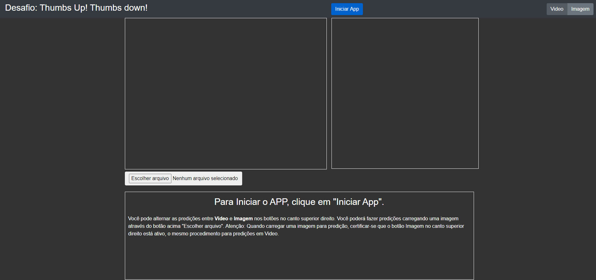
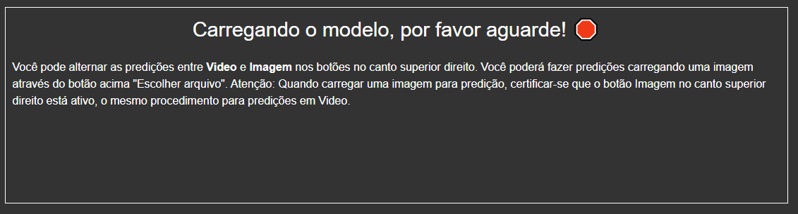
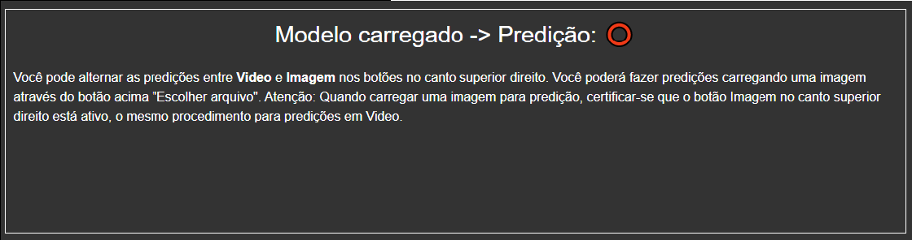
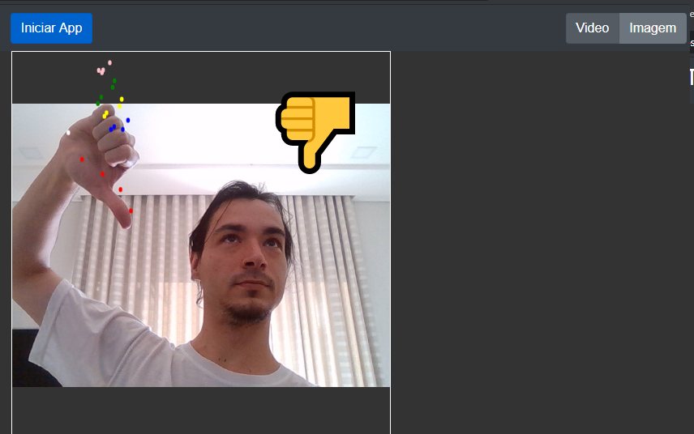

# Gesture_Recognition  
  
### Instruções:  
* Abrir a pasta thumbsupdown, clicar em index.html  
--------------------
  
* Caso queira usar por imagem docker, na pasta thumbsupdown executar o comando no terminal:   
```
docker build -t webserver-image:v1 .  
```
* Em seguida rodar o comando:  
```
docker run -d -p 3000:80 webserver-image:v1
```  
* Abrir o navegador em localhost:3000  
--------------------  
### Utilização  

* A seguinte tela irá subir:  
  
  
* Para Iniciar o App, clicar no botão azul na aba superior "Inicar App".   
* Você deve permitir o acesso a camera pelo navegador.  
* Após a permissão, o modelo handpose será baixado.  
> Mais informações sobre o modelo: https://blog.tensorflow.org/2020/03/face-and-hand-tracking-in-browser-with-mediapipe-and-tensorflowjs.html   
>> The handpose package detects hands in an input image or video stream, and returns twenty-one 3-dimensional landmarks locating features within each hand. Such landmarks include the locations of each finger joint and the palm.   
  
* Após a permissão a camera o modulo demora aproximadamente 12s para ficar pronto.   
  
   
* Quando o modelo estiver pronto, será possíver ver um circulo vermelho na tela conforme imagem abaixo:  

  
  
* As predições Thumbs Up Thumbs Down estao prontas para serem feitas em Video.  
  
   
 * Para fazer predições em imagens, no canto superior direito tem um botão para selecionar, clique em Imagem. Logo depois selecione sua imagem pelo botão "Escolher arquivo".
